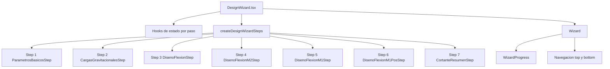

# Diseno de Viga - Arquitectura de Pasos

## Vista general

El flujo de diseno se implementa con un wizard de 7 pasos. La composicion principal vive en `src/features/diseno-viga/DesignWizard.tsx` y la configuracion de pasos (lazy loading + render por step) en `src/features/diseno-viga/config/designWizardSteps.tsx`.

## Montaje de pasos

## Componentes clave

- `DesignWizard.tsx`
  - Orquesta hooks de cada paso.
  - Calcula estados derivados transversales (ej. `showBanner`).
  - Ejecuta mock global (`applyDesignWizardMock`) por boton y `Ctrl + A`.
- `designWizardSteps.tsx`
  - Centraliza imports lazy y fallback de carga.
  - Construye arreglo `steps` para el componente `Wizard`.
- `Wizard.tsx`
  - Maneja navegacion, animacion de transicion y atajos (`Ctrl + J`, `Ctrl + L`).
  - Renderiza botones arriba y abajo.
- `WizardProgress.tsx`
  - Muestra progreso tipo "montana" (tamano segun distancia al paso actual).
  - Responsive con scroll horizontal para muchos pasos.

## Orden funcional de pasos

1. Datos Generales
2. Cargas Gravitacionales
3. Diseno de Flexion
4. M2(-) Derecho
5. M1(-) Izquierdo
6. M1(+) Izquierdo
7. Resumen
