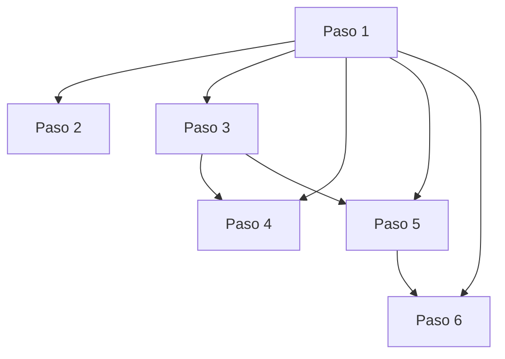

# Diseno de Viga - Diccionario de Datos por Paso

## Paso 1 - Datos Generales (`useParametrosBasicos`)

- Inputs de usuario:
  - `fc`, `gradoAcero`, `tipoConcreto`, `portico`, `bw`, `h`, `rec`, `L`
- Derivados:
  - `fy` (desde `gradoAcero`)
  - `lambda` (desde `tipoConcreto`)
  - `beta` (desde `fc`)
  - `d` peralte efectivo (desde `h` y `rec`)
- Validacion:
  - `errors` por campo
  - `isValid` global
- Salida usada por otros pasos:
  - geometria (`bw`, `h`, `d`, `rec`, `L`)
  - material (`fc`, `fy`, `beta`, `lambda`)
  - configuracion (`portico`)

## Paso 2 - Cargas Gravitacionales (`useCargasGravitacionales`)

- Inputs de usuario:
  - `AT`, `cvKgM2`, `scKgM2`, `Svd`
- Inputs heredados:
  - `bw`, `h` (desde paso 1)
- Derivados:
  - `intermedios` de cargas
  - `resultados` de tabla de cargas
- Validacion:
  - `errors`
  - `isValid`

## Paso 3 - Diseno de Flexion (`useDisenoFlexion`)

- Inputs de usuario:
  - `M1`, `Mcenter`, `M2`
- Inputs heredados:
  - `portico`, `L`, `d`, `bw`, `h` (desde paso 1)
- Derivados:
  - `chequeo` de seccion (`Ok`, `No Ok`, `No chequea`)
  - `procesos` de chequeo
  - constantes `PHI_FLEXION`, `BRAZO_J`
- Validacion:
  - `errors`
  - `isValid` (requiere campos + chequeo de seccion `Ok`)
- Salida usada por otros pasos:
  - `M2` para paso 4
  - `M1` para paso 5

## Paso 4 - M2(-) Derecho (`useDisenoFlexionM2`)

- Inputs de usuario:
  - `asEtabs`, `qty1`, `no1`, `qty2`, `no2`
- Inputs heredados:
  - `M2` (desde paso 3)
  - `fc`, `fy`, `beta`, `bw`, `d` (desde paso 1)
- Derivados:
  - `resultado` de diseno de refuerzo
  - `asMin`
  - `alertas`, `variantes`
- Validacion:
  - `errors`
  - `isValid`

## Paso 5 - M1(-) Izquierdo (`useDisenoFlexionM1`)

- Inputs de usuario:
  - `asEtabs`, `qty1`, `no1`, `qty2`, `no2`
- Inputs heredados:
  - `M1` (desde paso 3)
  - `fc`, `fy`, `beta`, `bw`, `d` (desde paso 1)
- Derivados:
  - `resultado` (incluye `phiMn`)
  - `asMin`
  - `alertas`, `variantes`
- Validacion:
  - `errors`
  - `isValid`
- Salida usada por otros pasos:
  - `phiMnNeg = resultado?.phiMn`
  - `asMin`

## Paso 6 - M1(+) Izquierdo (`useDisenoFlexionM1Pos`)

- Inputs de usuario:
  - `asEtabs`, `n1`, `no1`, `n2`, `no2`
- Inputs heredados:
  - Desde paso 1: `fc`, `fy`, `bw`, `h`, `d`, `rec`, `portico`
  - Desde paso 5: `phiMnNeg`, `asMin`
- Derivados:
  - `resultado` con chequeos y cumplimiento de DC
  - `variantes` de refuerzo
- Validacion:
  - `errors`
  - `isValid` (depende de `resultado.cumpleDC`)

## Paso 7 - Resumen (`CortanteResumenStep`)

- Estado actual:
  - placeholder visual para futura implementacion de cortante y resumen.

## Mapa compacto de dependencias

