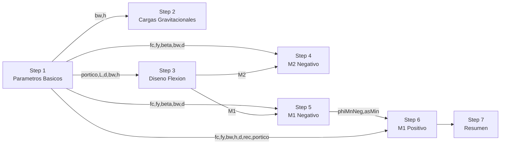
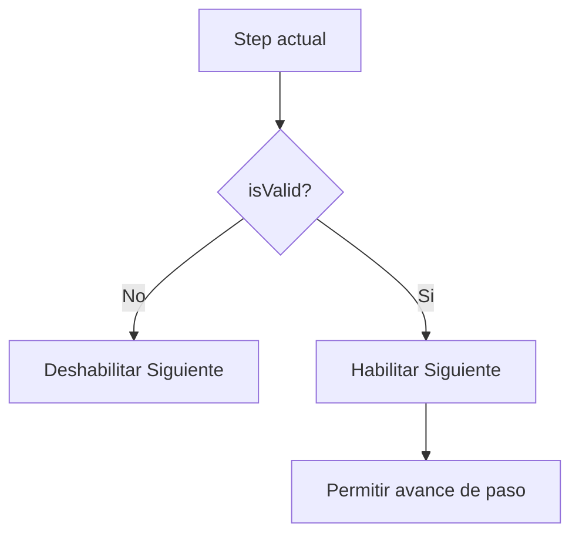
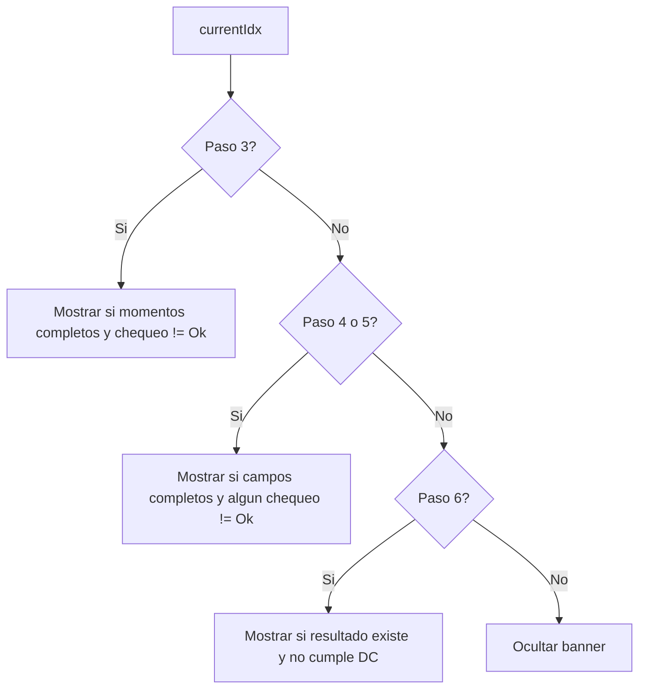
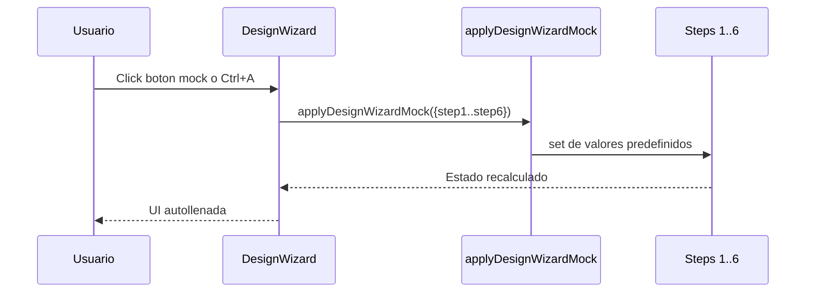

# Diseno de Viga - Flujo de Datos

## Flujo principal entre pasos

```mermaid
flowchart LR
  S1[Step 1\nParametros Basicos]
  S2[Step 2\nCargas Gravitacionales]
  S3[Step 3\nDiseno Flexion]
  S4[Step 4\nM2 Negativo]
  S5[Step 5\nM1 Negativo]
  S6[Step 6\nM1 Positivo]
  S7[Step 7\nResumen]

  S1 -->|bw,h| S2
  S1 -->|portico,L,d,bw,h| S3
  S1 -->|fc,fy,beta,bw,d| S4
  S1 -->|fc,fy,beta,bw,d| S5
  S3 -->|M2| S4
  S3 -->|M1| S5
  S5 -->|phiMnNeg,asMin| S6
  S1 -->|fc,fy,bw,h,d,rec,portico| S6
  S6 --> S7
```

## Flujo de validacion para navegacion

```mermaid
flowchart TD
  A[Step actual] --> B{isValid?}
  B -->|No| C[Deshabilitar Siguiente]
  B -->|Si| D[Habilitar Siguiente]
  D --> E[Permitir avance de paso]
```

## Flujo de banner de chequeos

```mermaid
flowchart TD
  A[currentIdx] --> B{Paso 3?}
  B -->|Si| C[Mostrar si momentos completos y chequeo != Ok]
  B -->|No| D{Paso 4 o 5?}
  D -->|Si| E[Mostrar si campos completos y algun chequeo != Ok]
  D -->|No| F{Paso 6?}
  F -->|Si| G[Mostrar si resultado existe y no cumple DC]
  F -->|No| H[Ocultar banner]
```

## Flujo de mock global

```mermaid
sequenceDiagram
  participant U as Usuario
  participant W as DesignWizard
  participant M as applyDesignWizardMock
  participant S as Steps 1..6

  U->>W: Click boton mock o Ctrl+A
  W->>M: applyDesignWizardMock({step1..step6})
  M->>S: set de valores predefinidos
  S-->>W: Estado recalculado
  W-->>U: UI autollenada
```
