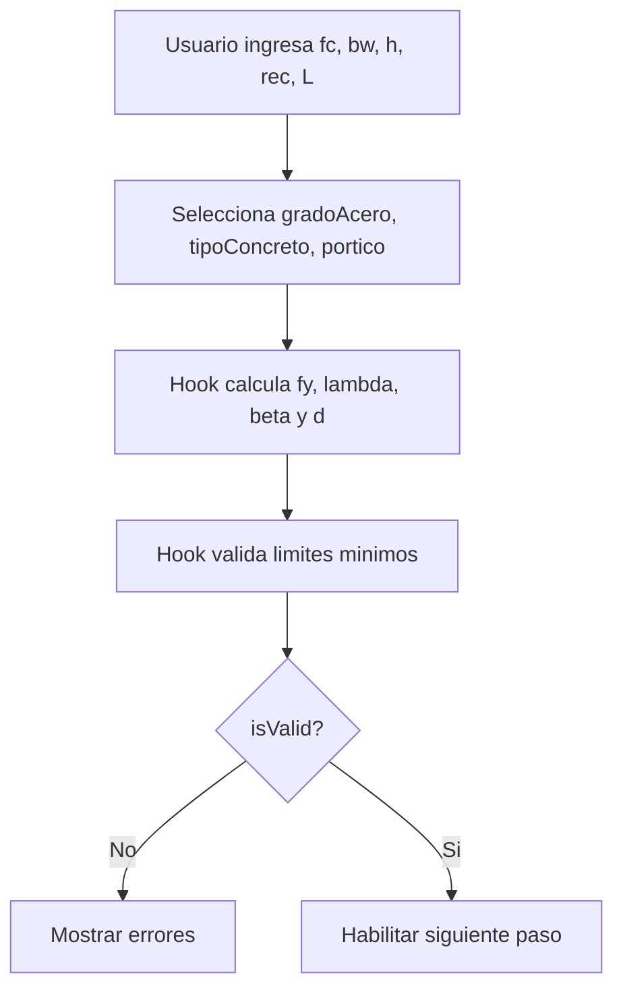
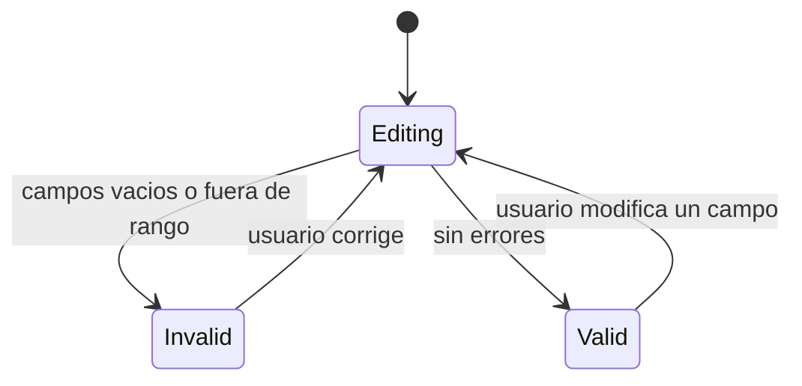

# Step 01 - Parametros Basicos

## Objetivo

Capturar geometria, materiales y configuracion estructural base para habilitar el resto del flujo.

## Diccionario de datos

| Campo          | Tipo    | Unidad  | Fuente     | Descripcion                                |
| -------------- | ------- | ------- | ---------- | ------------------------------------------ |
| `fc`           | number  | kgf/cm2 | usuario    | Resistencia a compresion del concreto      |
| `gradoAcero`   | enum    | -       | usuario    | Grado del acero de refuerzo (`G40`, `G60`) |
| `fy`           | number  | kgf/cm2 | derivado   | Fluencia del acero segun `gradoAcero`      |
| `tipoConcreto` | enum    | -       | usuario    | Tipo de concreto (`NORMAL`, `LIGERO`)      |
| `lambda`       | number  | -       | derivado   | Factor del concreto segun tipo             |
| `portico`      | enum    | -       | usuario    | Tipo de sistema (`P.E`, `P.I`, `P.O`)      |
| `bw`           | number  | cm      | usuario    | Ancho de la viga                           |
| `h`            | number  | cm      | usuario    | Altura total de la viga                    |
| `rec`          | number  | cm      | usuario    | Recubrimiento de concreto                  |
| `d`            | number  | cm      | derivado   | Peralte efectivo                           |
| `L`            | number  | m       | usuario    | Luz entre apoyos                           |
| `errors`       | object  | -       | validacion | Mensajes de validacion por campo           |
| `isValid`      | boolean | -       | validacion | Estado global del paso                     |

## Flujo del paso

## Diagrama de estados

## Formulas usadas (LaTeX)

$$
d = h - rec
$$

$$
\beta_1 =
\begin{cases}
0.85, & 175.76 \le f'_c \le 281.228 \\
0.85 - \dfrac{0.05f'_c - 210}{1000}, & 281.228 < f'_c < 562.45 \\
0.65, & f'_c \ge 562.45
\end{cases}
$$

Validaciones minimas:

$$
f'_c \ge 210,\quad b_w \ge 25,\quad h \ge 40,\quad rec \ge 4,\quad L > 0
$$
