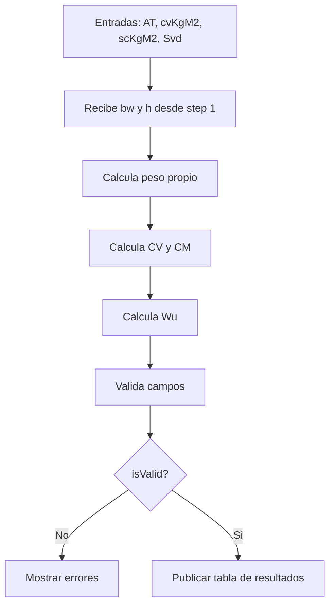
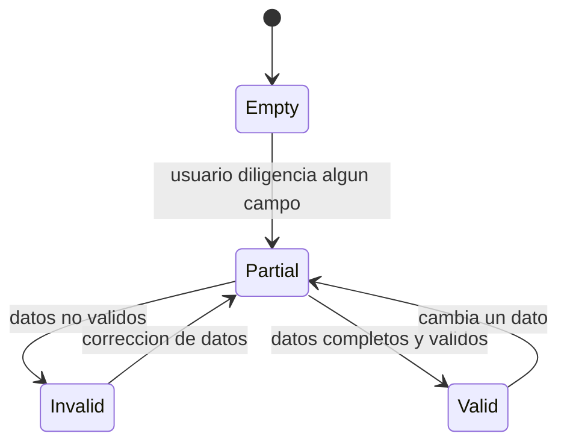

# Step 02 - Cargas Gravitacionales

## Objetivo

Convertir cargas por area en cargas lineales y calcular la carga mayorada `Wu`.

## Diccionario de datos

| Campo           | Tipo    | Unidad | Fuente     | Descripcion                                |
| --------------- | ------- | ------ | ---------- | ------------------------------------------ |
| `AT`            | number  | m2     | usuario    | Area tributaria que descarga en la viga    |
| `cvKgM2`        | number  | kg/m2  | usuario    | Carga viva por area                        |
| `scKgM2`        | number  | kg/m2  | usuario    | Sobrecarga/carga muerta adicional por area |
| `Svd`           | number  | adim   | usuario    | Factor de sismo vertical                   |
| `bw`            | number  | cm     | step 1     | Ancho de viga                              |
| `h`             | number  | cm     | step 1     | Altura de viga                             |
| `cvDistribuida` | number  | kgf/m  | derivado   | Carga viva distribuida                     |
| `cmDistribuida` | number  | kgf/m  | derivado   | Carga muerta distribuida                   |
| `pesoPropio`    | number  | kgf/m  | derivado   | Peso propio de la viga                     |
| `CM`            | number  | kgf/m  | derivado   | Carga muerta total lineal                  |
| `CV`            | number  | kgf/m  | derivado   | Carga viva total lineal                    |
| `Wu`            | number  | kgf/m  | derivado   | Carga ultima de diseno                     |
| `errors`        | object  | -      | validacion | Errores por campo                          |
| `isValid`       | boolean | -      | validacion | Estado global del paso                     |

## Flujo del paso

## Diagrama de estados

## Formulas usadas (LaTeX)

$$
W_{pp} = 2400 \cdot \frac{b_w h}{100^2}
$$

$$
CV = AT \cdot cv_{kg/m^2}
$$

$$
CM = W_{pp} + AT \cdot sc_{kg/m^2}
$$

$$
W_u = (1.2 + S_{vd})\cdot CM + CV
$$

Reglas de validacion:

$$
AT > 0,\quad cv_{kg/m^2} \ge 0,\quad sc_{kg/m^2} \ge 0,\quad S_{vd} \ge 0
$$
