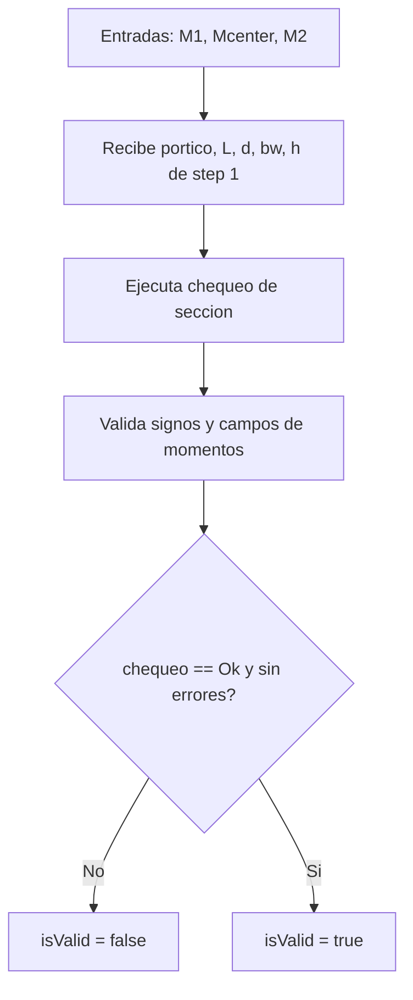
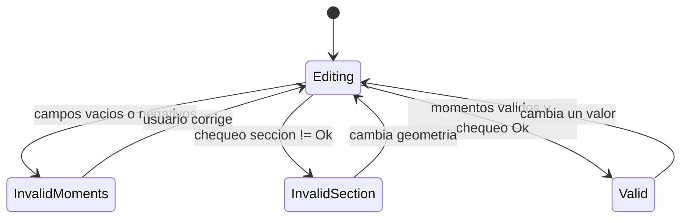

# Step 03 - Diseno de Flexion

## Objetivo

Capturar momentos de diseno y verificar condiciones geometricas minimas segun tipo de portico.

## Diccionario de datos

| Campo         | Tipo    | Unidad  | Fuente     | Descripcion                                        |
| ------------- | ------- | ------- | ---------- | -------------------------------------------------- |
| `M1`          | number  | kgf\*m  | usuario    | Momento en extremo izquierdo (se ingresa positivo) |
| `Mcenter`     | number  | kgf\*m  | usuario    | Momento en centro de vano                          |
| `M2`          | number  | kgf\*m  | usuario    | Momento en extremo derecho (se ingresa positivo)   |
| `portico`     | enum    | -       | step 1     | Tipo de portico (`P.E`, `P.I`, `P.O`)              |
| `fc`          | number  | kgf/cm2 | step 1     | Resistencia a compresion del concreto (contexto)   |
| `bw`          | number  | cm      | step 1     | Ancho de viga                                      |
| `h`           | number  | cm      | step 1     | Altura total                                       |
| `rec`         | number  | cm      | step 1     | Recubrimiento                                      |
| `d`           | number  | cm      | step 1     | Peralte efectivo                                   |
| `L`           | number  | m       | step 1     | Luz de viga                                        |
| `chequeo`     | enum    | -       | derivado   | Resultado del chequeo geometrico                   |
| `PHI_FLEXION` | number  | -       | constante  | Factor de reduccion a flexion (0.9)                |
| `BRAZO_J`     | number  | -       | constante  | Brazo interno asumido (0.9)                        |
| `errors`      | object  | -       | validacion | Errores por campo                                  |
| `isValid`     | boolean | -       | validacion | Estado global del paso                             |

## Flujo del paso

## Diagrama de estados

## Formulas usadas (LaTeX)

Chequeo para `P.E`:

$$
L\cdot 100 \ge 4d
$$

$$
b_w \ge \max(0.3h,\ 25)
$$

Brazo interno asumido:

$$
jd \approx 0.9d
$$

Validaciones de momentos:

$$
M_1 \ge 0,\quad M_{center} \ge 0,\quad M_2 \ge 0
$$
