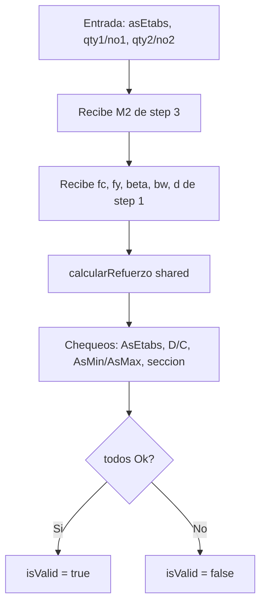
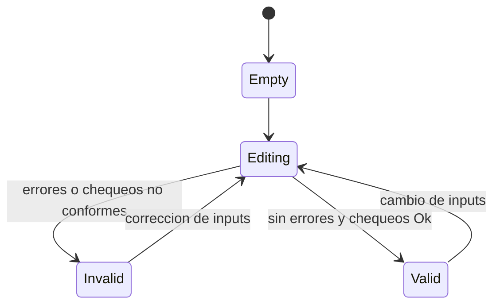

# Step 04 - Diseno de Flexion M2(-)

## Objetivo

Dimensionar acero longitudinal superior para el momento negativo M2 en el lado derecho.

## Diccionario de datos

| Campo                     | Tipo    | Unidad  | Fuente     | Descripcion                                 |
| ------------------------- | ------- | ------- | ---------- | ------------------------------------------- |
| `M2`                      | number  | kgf\*m  | step 3     | Momento de diseno en extremo derecho        |
| `fc`                      | number  | kgf/cm2 | step 1     | Resistencia a compresion del concreto       |
| `fy`                      | number  | kgf/cm2 | step 1     | Fluencia del acero                          |
| `bw`                      | number  | cm      | step 1     | Ancho de viga                               |
| `h`                       | number  | cm      | step 1     | Altura total de viga (referencia de modelo) |
| `rec`                     | number  | cm      | step 1     | Recubrimiento (referencia de modelo)        |
| `L`                       | number  | m       | step 1     | Luz de viga (referencia de modelo)          |
| `d`                       | number  | cm      | step 1     | Peralte efectivo                            |
| `beta`                    | number  | -       | step 1     | Factor del bloque equivalente de compresion |
| `asEtabs`                 | number  | cm2     | usuario    | Acero objetivo externo                      |
| `qty1`,`no1`,`qty2`,`no2` | number  | -       | usuario    | Configuracion de varillas                   |
| `asM2`                    | number  | cm2     | derivado   | Acero requerido                             |
| `asPropuesta`             | number  | cm2     | derivado   | Acero propuesto                             |
| `a`                       | number  | cm      | derivado   | Altura del bloque de compresion             |
| `c`                       | number  | cm      | derivado   | Profundidad al eje neutro                   |
| `phiMn`                   | number  | kgf\*m  | derivado   | Resistencia reducida                        |
| `dc`                      | number  | -       | derivado   | Demanda/capacidad                           |
| `asMin`,`asMax`           | number  | cm2     | derivado   | Limites reglamentarios de acero             |
| `chequeo*`                | enum    | -       | derivado   | Estados de control (Ok/No Ok)               |
| `isValid`                 | boolean | -       | validacion | Estado global del paso                      |

## Flujo del paso

## Diagrama de estados

## Formulas usadas (LaTeX)

$$
A_s = \frac{M\cdot 100}{\phi \cdot f_y \cdot j \cdot d}
$$

$$
A_{s,prop} = n_1A_{v1} + n_2A_{v2}
$$

$$
a = \frac{A_{s,prop}f_y}{0.85f'_cb_w}
$$

$$
\phi M_n = \frac{\phi A_{s,prop}f_y\left(d-\frac{a}{2}\right)}{100}
$$

$$
\frac{D}{C} = \frac{M}{\phi M_n}
$$

$$
A_{s,min}=\max\left(\frac{0.8\sqrt{f'_c}b_wd}{f_y},\ \frac{14b_wd}{f_y}\right)
$$

$$
A_{s,max}=0.025b_wd
$$

$$
c=\frac{a}{\beta_1},\qquad c<0.375d
$$
