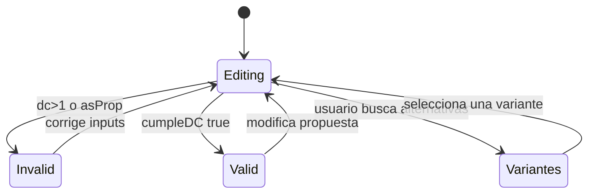

# Step 06 - Diseno de Flexion M1(+)

## Objetivo

Dimensionar refuerzo para momento positivo en apoyo izquierdo considerando demanda sismica minima y capacidad negativa del Step 05.

## Diccionario de datos

| Campo                 | Tipo    | Unidad  | Fuente   | Descripcion                              |
| --------------------- | ------- | ------- | -------- | ---------------------------------------- |
| `fc`                  | number  | kgf/cm2 | step 1   | Resistencia a compresion del concreto    |
| `fy`                  | number  | kgf/cm2 | step 1   | Fluencia del acero                       |
| `bw`                  | number  | cm      | step 1   | Ancho de viga                            |
| `h`                   | number  | cm      | step 1   | Altura total de la viga                  |
| `rec`                 | number  | cm      | step 1   | Recubrimiento                            |
| `L`                   | number  | m       | step 1   | Luz de viga (contexto global del modelo) |
| `d`                   | number  | cm      | step 1   | Peralte efectivo                         |
| `portico`             | enum    | -       | step 1   | Tipo de portico (`P.E`, `P.I`, `P.O`)    |
| `phiMnNeg`            | number  | kgf\*m  | step 5   | Capacidad negativa de referencia         |
| `asMin`               | number  | cm2     | step 5   | Minimo de acero requerido                |
| `asEtabs`             | number  | cm2     | usuario  | Acero de referencia externo              |
| `n1`,`no1`,`n2`,`no2` | number  | -       | usuario  | Configuracion de varillas                |
| `muSismico`           | number  | kgf\*m  | derivado | Minimo por regla sismica                 |
| `muEtabs`             | number  | kgf\*m  | derivado | Momento implicito de `asEtabs`           |
| `mu`                  | number  | kgf\*m  | derivado | Demanda final de diseno                  |
| `asReq`               | number  | cm2     | derivado | Acero requerido                          |
| `asPropuesta`         | number  | cm2     | derivado | Acero provisto                           |
| `a`                   | number  | cm      | derivado | Bloque de compresion equivalente         |
| `phiMn`               | number  | kgf\*m  | derivado | Resistencia reducida                     |
| `dc`                  | number  | -       | derivado | Relacion demanda/capacidad               |
| `cumpleAsMin`         | boolean | -       | chequeo  | Verifica minimo de acero                 |
| `cumpleDC`            | boolean | -       | chequeo  | Estado final de validacion del paso      |

## Flujo del paso

```mermaid
flowchart TD
  A[Recibe phiMnNeg y asMin desde step 5] --> B[Define factor sismico por portico]
  B --> C[Mu_sismico = factor * abs(phiMnNeg)]
  C --> D[Mu_etabs derivado desde asEtabs ingresado]
  D --> E[Mu = max(Mu_sismico, Mu_etabs)]
  E --> F[Calcula As_req]
  F --> G[Calcula As_prop segun n1/no1 y n2/no2]
  G --> H[Calcula a, phiMn y D/C]
  H --> I[Chequea AsMin, D/C y seccion controlada]
  I --> J{cumpleDC?}
  J -->|Si| K[isValid = true]
  J -->|No| L[isValid = false]
```

## Diagrama de estados



## Formulas usadas (LaTeX)

Factor sismico segun portico:

$$
\text{factor}=
\begin{cases}
0.5, & P.E \\
\frac{1}{3}, & P.I \\
0, & P.O
\end{cases}
$$

$$
M_{u,sismico}=\text{factor}\cdot |\phi M_{n,neg}|
$$

$$
M_{u,etabs}=\frac{A_{s,etabs}\cdot \phi \cdot f_y \cdot j \cdot d}{100}
$$

$$
M_u=\max(M_{u,sismico},M_{u,etabs})
$$

$$
A_{s,req}=\frac{M_u\cdot 100}{\phi \cdot f_y \cdot j \cdot d}
$$

$$
a=\frac{A_{s,prop}f_y}{0.85f'_cb_w},\qquad
\phi M_n=\frac{\phi A_{s,prop}f_y\left(d-\frac{a}{2}\right)}{100}
$$

$$
\frac{D}{C}=\frac{M_u}{\phi M_n},\qquad
c=\frac{a}{\beta_1},\qquad c<0.375d
$$
