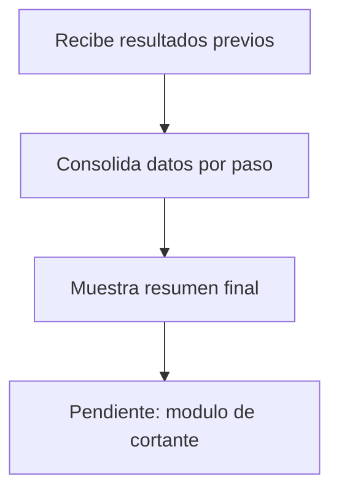
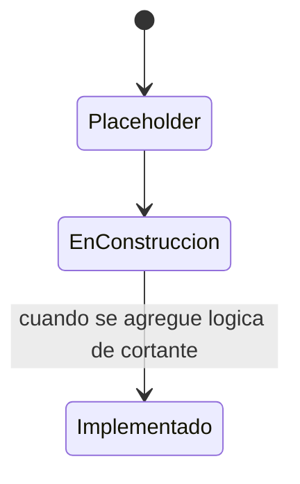

# Step 07 - Cortante y Resumen

## Objetivo

Presentar una vista final de resultados y, en una fase posterior, incluir el diseno por cortante.

## Diccionario de datos

| Campo                  | Tipo   | Unidad        | Fuente | Descripcion                             |
| ---------------------- | ------ | ------------- | ------ | --------------------------------------- |
| `fc`,`fy`              | number | kgf/cm2       | step 1 | Material base del proyecto              |
| `bw`,`h`,`rec`,`d`,`L` | number | cm/cm/cm/cm/m | step 1 | Geometria principal                     |
| `M1`,`Mcenter`,`M2`    | number | kgf\*m        | step 3 | Momentos de diseno usados en flexion    |
| `phiMnNeg`             | number | kgf\*m        | step 5 | Capacidad negativa para control sismico |
| `mu`,`phiMn`,`dc`      | number | varias        | step 6 | Resultado final de M1(+)                |
| `estadoResumen`        | string | -             | UI     | Estado de completitud del resumen       |

## Flujo del paso

## Diagrama de estados

## Formulas usadas (LaTeX)

Actualmente este paso es placeholder visual. No tiene formulas propias implementadas.
